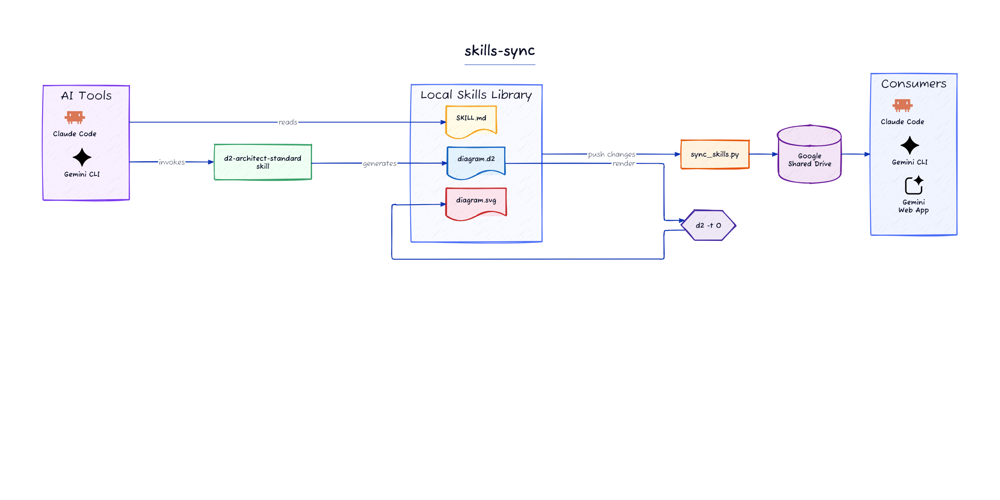

# skills-sync

A lightweight tool to sync your AI CLI skills library to Google Shared Drive — enabling cross-tool compatibility, cross-machine portability, and access from the Gemini web app.

> **Before you continue:** This tool requires a **Google Workspace account** (paid). Shared Drives are not available on free Gmail. If you only have a personal Google account, this won't work without code changes.

## The Problem

If you use Claude Code and Gemini CLI seriously, you build up a library of skills — reusable context files that shape how the AI behaves on specific tasks. The problem is three-fold:

1. **Cross-tool** — Claude Code and Gemini CLI both support skills but don't share them. A skill refined for Claude isn't available to Gemini, and vice versa.
2. **Cross-machine** — Your skills library lives on one machine. Set up a new laptop and you start from scratch.
3. **Web app access** — The Gemini web app and Custom Gems can reference Google Drive files as context. If your skills live on Drive, they're available there too.

A single sync script writing to Google Shared Drive solves all three at once.

## Architecture



## How It Works

```
~/.local/share/sync-skills/skills/
        │
        ▼  skills-sync (push)
Google Shared Drive  ◄──────────────────────────────────┐
        │                                                │
        ├──▶ Machine 2 (pull on setup)                   │
        ├──▶ Machine 3 (pull on setup)                   │
        └──▶ Gemini App / Custom Gem (references Drive)  │
                                                         │
        SA Key (scoped to this Shared Drive only) ───────┘
```

- **Push** (default) — incremental, only uploads files changed since last sync
- **Push --full** — forces re-upload of everything
- **Pull** — downloads the full skills library from Drive to local

## Prerequisites

- Python 3.8+
- A Google Cloud project with a Service Account and Google Drive API enabled
- **Google Workspace account** — Shared Drives are a Workspace feature (not available on free Gmail). If you only have a personal Google account, this tool won't work without code changes to target a regular My Drive folder instead.
- A Google Shared Drive
- The SA granted `Content Manager` access on the Shared Drive only
- **D2** (open source, [terrastruct/d2](https://github.com/terrastruct/d2)) — installed automatically by `install.sh` via the official install script. Required for diagram generation. Self-contained Go binary, no runtime dependencies. For secure environments where piping curl to sh is not acceptable, download and verify a release binary directly from the [D2 releases page](https://github.com/terrastruct/d2/releases).

### Setting Up the Service Account

1. Go to [Google Cloud Console](https://console.cloud.google.com) → IAM & Admin → Service Accounts
2. Create a new SA (e.g. `skills-sync`)
3. Create and download a JSON key (treat it like a password — it grants write access to your Shared Drive)
4. In Google Drive, open your Shared Drive → Manage members → add the SA email with `Content Manager` role

### Finding your Shared Drive ID

Open the Shared Drive in your browser. The URL will look like:
```
https://drive.google.com/drive/folders/0AALIUj_e6cRVUk9PVA
                                        ^^^^^^^^^^^^^^^^^^^^
                                        this is your DRIVE_ID
```

> **Security note:** Grant `Content Manager` on the target Shared Drive only — not your personal Drive or GCP project broadly. A compromised key with this scope can only read/write one folder.

## Installation on a New Machine

**Step 1** — Clone this repo (or download the files from your Shared Drive if you stored them there):
```bash
git clone https://github.com/curtiskrygier/skills-sync.git
cd skills-sync
```

**Step 2** — Place your SA key `.json` file in the same folder as `install.sh`.

**Step 3** — Run the installer:
```bash
bash install.sh
```

The script detects your key file automatically and prompts for your Drive ID. That's it.

### Heredoc mode (password manager workflow)

If you store your key base64-encoded in a password manager rather than as a file, pass everything via heredoc instead:

> **Shell history:** The heredoc passes your SA key through the terminal and may be saved to `.bash_history` / `.zsh_history`. Run `unset HISTFILE` before pasting to prevent this, then restore `HISTFILE` to its previous value afterwards.

```bash
bash install.sh << 'EOF'
DRIVE_ID=YOUR_SHARED_DRIVE_ID
SA_NAME=your-sa-key-filename.json
SA_KEY_B64=YOUR_BASE64_ENCODED_SA_KEY
DRIVE_FOLDER=skills   # optional subfolder within the Shared Drive
EOF
```

### What install.sh does

- Writes and secures the SA key (`chmod 600`) in `~/.local/share/sync-skills/`
- Sets up a Python venv at `~/.local/share/sync-skills/venv/`
- Installs `sync_skills.py` and dependencies
- Pulls your full skills library from Drive into `~/.local/share/sync-skills/skills/`
- Installs a `skills-sync` wrapper command to `~/.local/bin/`
- Symlinks `~/.gemini/skills → skills/` for Gemini CLI
- Symlinks `~/.claude/skills → skills/` for Claude Code
- Adds a skills reference to `~/.claude/CLAUDE.md` for Claude Code context

**One script, fully bootstrapped.**

### Storing the SA key in your password manager

On your existing machine, encode the key:
```bash
# Linux
base64 -w 0 path/to/your-sa-key.json

# macOS (no -w flag — wraps at 76 chars, handled automatically by install.sh)
base64 path/to/your-sa-key.json
```

Store the output in your password manager (Bitwarden, 1Password, etc.). On a new machine, decode it directly to a file:
```bash
# Linux
echo "PASTE_BASE64_HERE" | base64 -d > your-sa-key.json

# macOS
echo "PASTE_BASE64_HERE" | base64 -D > your-sa-key.json
```

> **Note:** `base64` is encoding, not encryption. Your password manager's own security (ideally with 2FA) is the lock on this credential.

## Directory Structure

After install:

```
~/.local/share/sync-skills/    ← all tool infrastructure
├── sync_skills.py
├── venv/                      ← Python venv
├── YOUR_SA_KEY.json           ← never committed, never synced
├── .config                    ← Drive ID and folder, written by install.sh
├── .last_sync                 ← timestamp of last successful push
└── skills/                    ← your skills library
    ├── example/
    │   └── SKILL.md           ← copy this as a starting point for new skills
    ├── my-skill/
    │   └── SKILL.md
    └── ...

~/.gemini/skills  → ~/.local/share/sync-skills/skills   ← Gemini CLI
~/.claude/skills  → ~/.local/share/sync-skills/skills   ← Claude Code

~/.local/bin/skills-sync   ← wrapper command
```

Both tools point at the same skills directory. A skill added in Claude Code is immediately visible in Gemini CLI and vice versa — no sync step needed between tools.

## Usage

```bash
skills-sync                  # push changes to Drive (incremental)
skills-sync --full           # push everything
skills-sync --dry-run        # preview push (no credentials needed)
skills-sync --pull           # pull latest from Drive
skills-sync --pull --dry-run # preview pull
```

> **PATH:** `~/.local/bin` must be in your PATH for `skills-sync` to work. Most Linux distributions include this by default. If not, add `export PATH="$HOME/.local/bin:$PATH"` to your shell profile.

`DRIVE_FOLDER` and `SHARED_DRIVE_ID` can also be passed as environment variables at runtime:
```bash
SHARED_DRIVE_ID=your_id DRIVE_FOLDER=skills skills-sync
```

> **Note:** Incremental push tracks changes using a `.last_sync` timestamp. If you restore files from a backup or clone the skills directory from git (which resets file modification times), use `--full` on the first push to ensure everything uploads correctly.

## Skill Format Compatibility

Both Claude Code and Gemini CLI use markdown-based skill files:

| Tool | Format | Location |
|---|---|---|
| Gemini CLI | `SKILL.md` inside a named folder | `~/.gemini/skills/skill-name/SKILL.md` |
| Claude Code | `SKILL.md` inside a named folder, invoked with `/skill-name` | `~/.claude/skills/skill-name/SKILL.md` |

Since both paths symlink to the same directory, the same files work in both tools automatically.

To verify skills are working after install, type `/` in Claude Code — your skills should appear in the menu. For Gemini CLI, ask it to use the example skill.

## Gemini App / Custom Gems

With Gemini Advanced (included with most Google Workspace plans), you can create a Custom Gem that references your Shared Drive folder directly as its knowledge base. Your skills become available in the Gemini web app without any extra steps.

## Security Considerations

- The SA key is **never synced to Drive** — it lives in `~/.local/share/sync-skills/` which is never uploaded
- The SA should have `Content Manager` access on the target Shared Drive **only**
- `base64` is transport encoding, not encryption — use a properly secured password manager
- The install directory is `chmod 700`; the key file and config are `chmod 600`
- A `.gitignore` covering `*.json` and `.last_sync` is written at install time

### If your SA key is compromised

Act immediately — the key grants persistent write access to your Shared Drive until explicitly revoked:

1. **Fastest:** Open Google Drive → your Shared Drive → Manage members → remove the SA email. This cuts access instantly without needing GCP access.
2. Go to [Google Cloud Console](https://console.cloud.google.com) → IAM & Admin → Service Accounts
3. Find your `skills-sync` SA → **Keys** tab → delete the compromised key
4. Create a new key, re-encode it, and update your password manager
5. Re-run `install.sh` on each machine to deploy the new key
6. Review your Shared Drive activity log (Drive → your Shared Drive → Activity panel) for unexpected changes

Revoking the key in GCP is instant — the old key stops working immediately regardless of where copies exist.

### Higher Security: Environment Variable Mode

For shared machines or environments where you want zero local credential footprint, pass the SA key as an environment variable. The key lives only in memory for the duration of the script.

```bash
export SHARED_DRIVE_ID="YOUR_SHARED_DRIVE_ID"

# Linux
export SA_KEY_JSON=$(echo "YOUR_BASE64_ENCODED_SA_KEY" | base64 -d)
# macOS
export SA_KEY_JSON=$(echo "YOUR_BASE64_ENCODED_SA_KEY" | base64 -D)

skills-sync
```

Nothing is written to disk. The credentials exist only for the life of the shell session.

## Alternatives

**Git-based sync** is the obvious alternative and worth considering seriously:
- Full version history on every skill change
- Works with any Google account (no Workspace required)
- Most developers already have the tooling set up

However, it doesn't solve all three problems without additional work:
- **Cross-machine** ✓ — git handles this well
- **Cross-tool** ✓ — same repo, different local paths
- **Gemini app / Custom Gems** ✗ — Drive access still requires a sync step (e.g. GitHub Actions), which means storing a service account key in GitHub Secrets anyway

On the security side, git introduces its own risks for credential-adjacent workflows: accidental commits of key files are permanent in history (even after removal), and a public repo is one bad `.gitignore` away from exposure. With this tool, the credential never touches a repo — it lives in your password manager and on disk with `600` permissions, scoped to a single Shared Drive.

If you're already Workspace-native and want Gemini app access without extra automation, Drive sync is the simpler path. If you're Git-first and don't need the Gemini web app integration, a private repo is a perfectly valid choice.

## Updating Dependencies

`requirements.lock` pins all dependencies to exact versions with SHA256 hashes. When you want to update:

```bash
# Install pip-tools into the venv if not already present
~/.local/share/sync-skills/venv/bin/pip install pip-tools

# Regenerate the lockfile from requirements.txt
~/.local/share/sync-skills/venv/bin/pip-compile --generate-hashes requirements.txt --output-file requirements.lock

# Review what changed before committing
git diff requirements.lock
```

Treat the lockfile diff like a dependency PR — check what changed and why before committing. After regenerating, re-run `install.sh` on each machine to apply the updated packages.

## License

MIT
